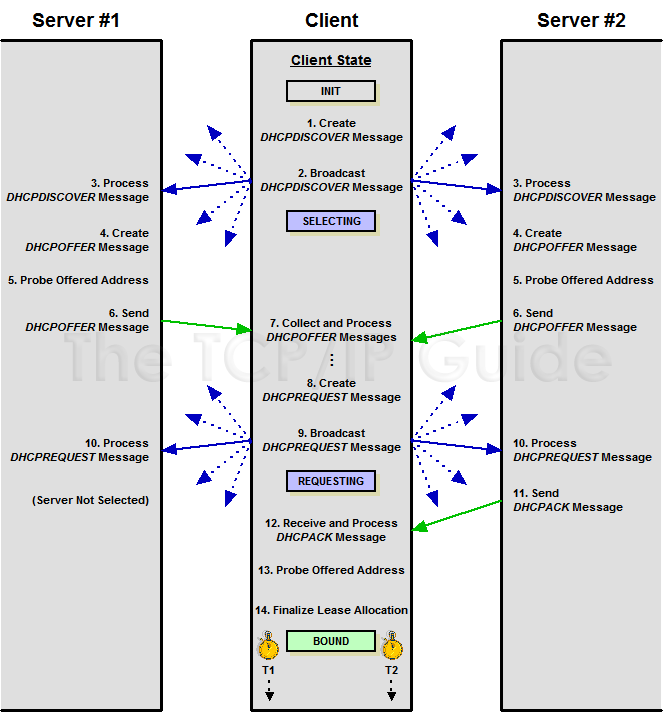

## Giao thước DHCP
### 1. Giới thiệu chung
#### 1.1. Khái niệm
DHCP (Dynamic Host Configuration Protocol) Giao thức Cấu hình Host Động). DHCP là một giao thức hoạt động theo mô hình Client / Server , nó tự động cung cấp địa chỉ IP cho một Host cùng với các thông tin cấu hình khác có liên quan đến giao thức Internet (IP) như subnet mask và Default gateway, DNS Server

Nhiều loại thiết bị hổ trợ chức năng DHCP server ví dụ như: các máy chủ Windows Server, Các Router (bộ định tuyến)

DHCP server sử dụng cổng 67, DHCP client sử dụng cổng 68
#### 1.2. Lợi ích
- Khi không có DHCP, phải gán địa chỉ IP lên các thiết bị bằng cách thủ công công việc này rất tẻ nhạt và tốn nhiều thời gian và  khả năng lỗi, xung đột do trùng lặp địa chỉ IP rất cao nhất.
- Khi có DHCP, mọi thứ sẽ trở nên đơn giản hơn, từ việc gán địa chỉ IP, quản lý thông tin cấu hình IP và loại bỏ các IP lỗi,… tất cả đều được thực hiện tự động. Giamr bớt gánh nặng cho người quản trị mạng.

### 2. Cơ chế cấp địa chỉ IP
- Manual allocation: Địa chỉ được gán thủ công bởi người quản trị
- Automatic allocation: DHCP tự động gán một địa chỉ IP vĩnh viễn với một thiết bị, chọn từ một pool IP có sẵn. Sử dụng trong trường hợp có đủ địa chỉ IP cho mỗi thiết bị có thể kết nối vào mạng. Automatic Allocation được coi là một trường hợp đặc biệt của Dynamic Allocation 
- Dynamic Allocation: DHCP gán một địa chỉ IP từ một pool trong một khoảng thời gian nhất định được quy định bởi server, hoặc cho đến khi client nói với DHCP server là nó không cần địa chỉ này nữa.
Lợi ích:
		- Automation: mỗi client có thể được tự động gán IP khi nó cần mà không cần tới sự can thiệp của người quản trị viên để quyết định địa chỉ cho client đó.
		- Quản lý tập trung: tất cả các IP được quản lý bởi DHCP server. Dễ ràng cho viêc mtheo dõi và bảo trì.
		- Tái sử dụng và chia sẻ địa chỉ IP: Hết thời gain kết nối IP sẽ đc cấp cho các thiết bị khác. 
		- Khả năng di chuyển giữa các mạng: với việc dynamic allocation, không có sự phân bổ địa chỉ IP nào được xác định trước, do đó bất kỳ client nào đều có thể yêu cầu một IP. Điều này làm cho nó trở thành một lựa chọn lý tưởng cho việc hỗ trợ các thiết bị di động và di chuyển giữa các mạng.
		- Tránh các vấn đề xung đột: Vì địa chỉ IP đều được xác định từ một pool và quản lý bởi máy chủ DHCP nên việc xung đột IP là có thể tránh được.

### 3. Kiến trúc DHCP
Kiến trúc bên trong DHCP bao gồm: DHCP server, DHCP client và DHCP relay agents. Trong đó:
- DHCP server đóng vai trò cấp phát địa chỉ IP cho các thiết bị.
- DHCP client là thiết bị kết nối mạng bất kì và có thể giao tiếp với máy chủ.  VD: đt, máy tính, máy in, server.
- DHCP relay agents là thiết bị trung gian, chuyển tiếp các yêu cầu giữa DHCP server và DHCP client. Chúng không phải là thành phần thiết yếu, nhưng khi làm việc với các hệ thống mạng lớn, phức tạp, chúng lại trở nên rất cần thiết.

### 4. Các gói tin trong DHCP
- Gói tin Discover: được tạo ra bởi Client để tìm ra DHCP server. Một DHCP Client khi mới tham gia vào hệ thống mạng. Nó sẽ yêu cầu thông tin địa chỉ IP từ DHCP Server bằng cách gửi bản tin broadcast (255.255.255.255) vì client chưa có địa chỉ IP.
- Bản tin Offer: Khi DHCP Server nhận được gói DHCP Discover từ client. Nó sẽ gửi lại một gói DHCP Offer chứa các thông số như địa chỉ IP, Subnet Mask, Gateway,…cho client . Có thể nhiều DHCP server sẽ gửi lại gói DHCP Offer nhưng Client chỉ chấp nhận gói DHCP Offer đầu tiên nó nhận được.
- Gói tin Request : Khi DHCP Client nhận được một gói DHCP Offer. Nó đáp lại bằng việc gửi bản tin DHCP Request để xác nhận hoặc để kiểm tra lại các thông tin mà DHCP Server vừa gửi.
- DHCP Acknowledge: được gửi bởi DHCP server để cấp phát địa chỉ và một số thông số như subnet mask, default gateway, DNS server….
- DHCP Nak: Nếu một địa chỉ IP đã hết hạn hoặc đã được cấp phát cho một Client khác. DHCP Server gửi gói DHCP Nak cho Client. Client muốn sử dụng lại địa chỉ IP thì phải bắt đầu tiến trình thuê lại địa chỉ IP.
- DHCP Decline: Nếu DHCP Client nhận được bản tin trả về không đủ thông tin hoặc hết hạn. Nó sẽ gửi gói DHCP Decline đến các Server để yêu cầu thiết lập lại tiến trình thuê địa chỉ IP.
- DHCP Release: Client gửi bản tin này đến Server để ngừng thuê IP. Khi nhận được bản tin này, server sẽ thu hồi lại IP đã cấp cho Client.
- DHCP INFORM: Các thiết bị không sử dụng DHCP để lấy địa chỉ IP vẫn có thể sử dụng khả năng cấu hình khác của nó. Một client có thể gửi một bản tin DHCP INFORM để yêu cầu bất kì máy chủ có sẵn nào gửi cho nó các thông số để mạng hoạt động. DHCP server đáp ứng với các thông số yêu cầu – được điền trong phần tùy chọn của DHCP trong bản tin DHCP ACK.

### 5. Hoạt động cấp phát mới IP và cấp lại Ip
#### 5.1. Cấp mới IP

- Bước 1: Client tạo bản tin DHCPDISCOVER
Ban đầu, client ko có địa chỉ Ip nó sẽ tạo 1 bản tin DHCP Discover chứa địa chỉ MAC và có thể chứa cả địa chỉ IP đã thuê trước đó.
- Bước 2: Client gửi bản tin Discover 
Client liên tục gửi broadcast bản tin DHCP DISCOVER trên mạng 
- Bước 3: Server nhận và xử lý bản tin DHCP DISCOVER
Mỗi DHCP server trên mạng LAN nhận được bản tin DHCP DISCOVER của client và kiểm tra nó. Server tìm kiếm phần địa chỉ MAC của client trong database và chọn cho nó một IP phù hợp đồng thời các thông số liên quan. Nếu client yêu cầu một IP xác định thì server sẽ xử lý yêu cầu nó. Server có thể quyết định việc nó dùng địa chỉ IP chỉ định kia là hợp lệ hay không để gửi reply về.
- Bước 4: Server tạo bản tin DHCP OFFER
Mỗi DHCP server trên mạng Lan nhận được bản tin DHCP Discover nó sẽ tìm kiếm địa chỉ MAC của client trong database và chọn cho nó một IP phù hợp. Nếu client yêu cầu một IP xác định thì server sẽ xem xét xử lý yêu cầu nó. 
Mỗi server được chọn trả lời lại cho client tạo bản tin DHCP OFFER bao gồm các thông tin sau: địa chỉ IP, subnet mask, địa chỉ IP của máy chủ (địa chỉ Gateway) và thời gian cho thuê đến Client, DNS Server…..
- Bước 5: Server kiểm tra địa chỉ IP mà cấp phát cho client đã được một thiết bị nào khác sử dụng hay chưa bằng cách gửi bản tin ICMP.
Nếu IP đó đã được sử dụng thì nó sẽ chọn lại địa chỉ IP khác cho client.
Nếu IP chưa được sử dụng, server sẽ cấp phát IP cho client.
- Bước 6: Các Server gửi bản tin DHCPOFFER
- Bước 7: Client nhận và xử lý bản tin DHCPOFFER
Client nhận bản tin DHCP OFFER và nó sẽ chọn lựa server nào mà nó nhận được bản tin DHCP OFFER đầu tiên. Nếu không nhận được bản tin DHCP OFFER nào sau một thời gian, client sẽ tạo lại bản tin DHCP DISCOVER và gửi lại từ đầu.
- Bước 8: Client tạo bản tin DHCP REQUEST
Khi nhận được bản tin Offer, Client tạo bản tin DHCP REQUEST cho các server vứi nội dung nó chấp nhận địa chỉ IP nào, từ Server nào để yêu cầu DHCP Server cấp phát địa chỉ IP .

- Bước 9: Client gửi bản tin DHCP REQUEST
Client gửi broadcast bản tin DHCP REQUEST. Sau đó chờ reply từ server.
- Bước 10: Các server nhận và xử lý bản tin DHCP REQUEST
Mỗi server nhận được bản tin REQUEST của client. Các server không được chọn sẽ bỏ qua bản tin này.
- Bước 11: Server gửi bản tin DHCPACK hoặc DHCPNAK.
Server được chọn sẽ kiểm tra xem địa chỉ IP nó OFFER cho còn sử dụng được hay không. Nếu không còn, nó sẽ gửi lại DHCPNAK (negative acknowledgment). Thông thường, server sẽ vẫn dành địa chỉ IP đó cho client, server sẽ gửi lại bản tin DHCPACK để xác nhận và cấp các thông số phát địa chỉ IP, subnet mask, địa chỉ Gateway  và các thông tin khác cho Client.
- Bước 12: Client nhận bản tin DHCPACK hoặc DHCPACK
Client sẽ nhận lại bản tin DHCPACK hoặc DHCPNAK từ server.
	- Nếu là DHCPNAK, client sẽ bắt đầu gửi lại DISCOVER từ bước 1.
	- Nếu là DHCPACK, client đọc địa chỉ IP trong trường YIAddr, ghi lại các thông số khác trong phần DHCP option.
Nếu không nhận được bản tin nào, client sẽ gửi lại DHCP REQUEST một hoặc vài lần nữa. Sau một khoảng thời gian vẫn không nhận được gì, nó sẽ bắt đầu lại từ Bước 1.
- Bước 13: Client kiểm tra xem IP được sử dụng hay chưa.
Client sẽ kiểm tra lần cuối trước khi xác định chắc chắn IP chưa được thiết bị khác sử dụng trước khi sử dụng nó. Bước này sẽ được thực hiện bởi giao thức ARP trên mạng LAN.
	- Nếu có bất kì thiết bị nào phản hồi lại ARP, client sẽ gửi bản tin DHCP DECLINE lại server để thông báo với server rằng IP đó đã được máy khác sử dụng. Và client trở lại Bước 1.
	- Nếu không có phản hồi, client sẽ sử dụng IP. Kết thúc quá trình Lease Allocation.

#### 5.2. Cấp phát lại IP
Trong một vài trường hợp khi chưa hết thời hạn hợp đồng cho thuê IP mà client khởi động lại hoặc ngắt kết nối với mạng sau đó lại muốn kết nối mạng lại thì không cần xin cấp phát mới Ip mà chỉ cần xin cấp phát lại Ip bằng cách Client gửi 1 bản tin request để tìm server hiện tại đang quản lý thông tin về hợp đồng mà nó đang thuê. Server đó gửi lại để xác nhận xem hợp đồng của client còn hiệu lực hay không. Nếu còn thì Client sẽ yêu cầu tiếp tục hợp đồng. Nếu không sẽ yêu cầu cấp phát lại.

ipconfig /release để hủy bỏ IP đã thuê.
ipconfig /renew để xin cấp mới địa chỉ IP

**Bổ sung LAB DHCP**
#### Tài liệu tham khảo
https://github.com/hocchudong/thuctap012017/blob/master/TamNT/DHCP
