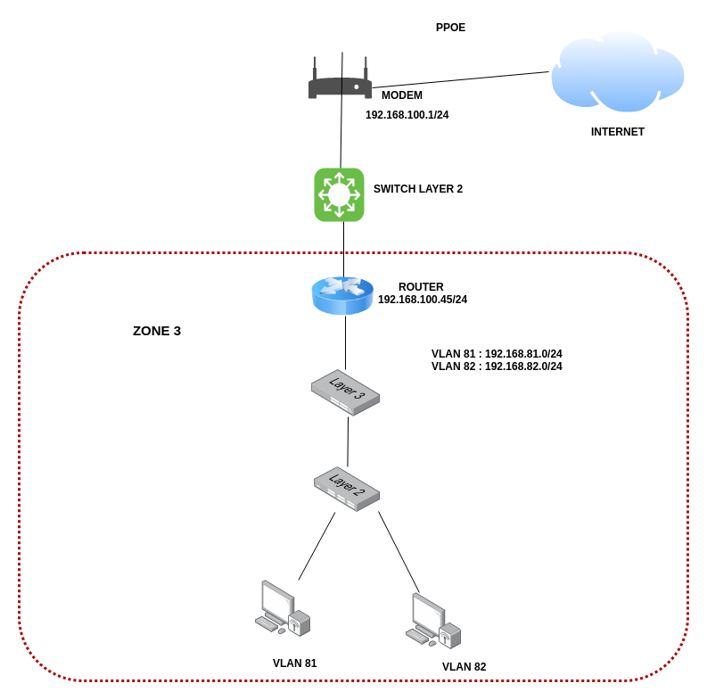
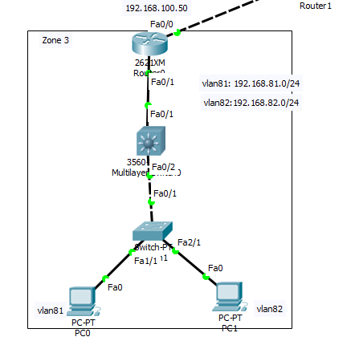

### Lap 1

Topo mạng 





**Yêu cầu:**

Cấu hình các thiết bị trong ZONE 3 
	- Reset cấu hình các thiết bị 
	- Cấu hình ban đầu cho switch router : hostnname, password
 	- Cấu hình IP, SSH cho các thiết bị router và switch
	- Cấu hình VLAN , VTP Server trên switch layer 3
	- Cấu hình VTP client trên switch layer 2
	- Cấu hình DHCP Server trên Switch Layer 3, đảm bảo các PC sẽ nhận IP động
	- Cấu hình inter VLAN  : Router on stick 
	- Định  tuyến cho các Client có thể truy cập ra internet


1. Reset cấu hình các thiết bị

2. Cấu hình hostname, password cho switch, router 
```
router(config)#hostname R1
R1(config)#enable secret "pass"
```
```
switch(config)#hostname SW_L3
SW_L3(config)#enable secret "pass"
```
```
switch(config)#hostname SW_L2
SW_L2(config)#enable secret "pass"
```

3. Cấu hình IP, SSH cho các thiết bị router và switch

```
R1(config)#int f0/0
R1(config)#ip add 192.168.100.50 255.255.255.0
```

```
R1(config)#username chi password "pass"
R1(config)#ip domain-name mdt
R1(config)#crypto key generate rsa
R1(config)#line vty 0 15
R1(config-line)#transport input ssh
R1(config-line)#login local
```
```
SW_L3(config)#username chi password "pass"
SW_L3(config)#ip domain-name mdt
SW_L3(config)#crypto key generate rsa
SW_L3(config)#line vty 0 15
SW_L3(config-line)#transport input ssh
SW_L3(config-line)#login local
```
```
SW_L2(config)#username chi password "pass"
SW_L2(config)#ip domain-name mdt
SW_L2(config)#crypto key generate rsa
SW_L2(config)#line vty 0 15
SW_L2(config-line)#transport input ssh
SW_L2(config-line)#login local
```

4. Tao vlan sw3

```
SW_L3(config)#vlan 81
SW_L3(config)#int vlan 81
SW_L3(config-f)# ip add 192.168.81.2 255.255.255.0
```

```
SW_L3(config)#vlan 82
SW_L3(config)#int vlan 82
SW_L3(config-f)#ip add 192.168.82.3 255.255.255.0
```

5. vtp server sw3, vtp client sw2

```
SW_L3(config)#vtp mode server
SW_L3(config)#vtp domain mdt
SW_L3(config)#vtp password "pass"
```
```
SW_L2(config)#vtp mode client
SW_L2(config)#vtp domain mdt
SW_L2(config)#vtp password "pass"
```

6. DHCP sw3

```
SW_L3(config)#ip dhcp pool vlan81
SW_L3(dhcp-config)#network 192.168.81.0 255.255.255.0
SW_L3(dhcp-config)#default-router 192.168.81.1
SW_L3(dhcp-config)#dns-server 8.8.8.8
SW_L3(config)#ip dhcp pool vlan82
SW_L3(dhcp-config)#network 192.168.82.0 255.255.255.0
SW_L3(dhcp-config)#default-router 192.168.82.1
SW_L3(dhcp-config)#dns-server 8.8.8.8
```

7. Cấu hình inter VLAN  : Router on stick 

```
R1(config)#interface fastEthernet0/2.81
R1(config-t)#encapsulation dot1q 81
R1(config-t)#ip address 191.168.81.1 255.255.255.0
R1(config-t)#interface fastEthernet0/2.81
R1(config-t)encapsulation dot1q 81
R1(config-t)ip address 191.168.81.1 255.255.255.0
```

8. Trunk 

```
SW_L3(config)#int f0/1
SW_L3(config-f)#switch port trunk encapsu dot1q
SW_L3(config-f)#sw p mode trunk
```
```
SW_L3(config)#int f0/2
SW_L3(config-f)#switch port trunk encapsu dot1q
SW_L3(config-f)#sw p mode trunk
```
```
SW_L2(config)#int f0/1
SW_L2(config-f)#switch port mode trunk
SW_L2(config-f)#switch port trunk allowed valn 81,82
```

8. Gán vlan

```
SW_L2(config)interface FastEthernet1/1
SW_L2(config-if)switchport access vlan 81
SW_L2(config-if)switchport mode access
SW_L2(config)interface FastEthernet2/1
SW_L2(config-if)switchport access vlan 82
SW_L2(config-if)switchport mode access
```
```
SW_L2(config)interface Vlan81
SW_L2(config-if)ip address 192.168.81.3 255.255.255.0
SW_L2(config)interface Vlan81
SW_L2(config-if)ip address 192.168.81.3 255.255.255.0
```

9. Nat

```
R1(config)access-list 1 permit 192.168.81.0 0.0.0.255
R1(config)access-list 1 permit 192.168.82.0 0.0.0.255
R1(config)ip nat inside source list 1 interface FastEthernet0/0 overload
R1(config)#int f0/0
R1(config-if)ip nat outside
R1(config)#int f0/1.81
R1(config-if)ip nat inside
R1(config)#int f0/1.82
R1(config-if)ip nat inside
```

```
ip route 0.0.0.0 0.0.0.0 192.168.100.1
```


Kết quả: Máy tính kết nối được ra internet và ssh được các thiết bọ switch, router. 