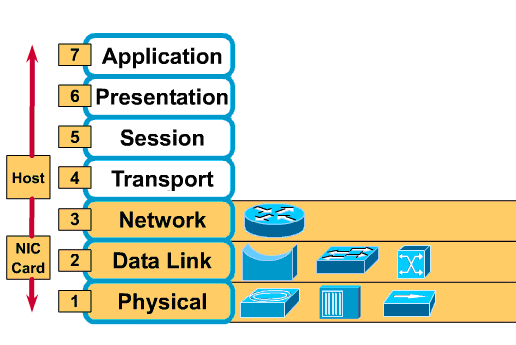
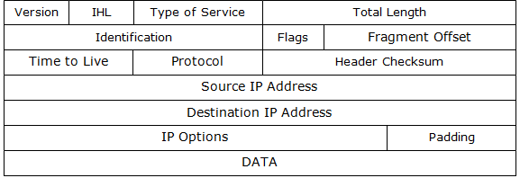
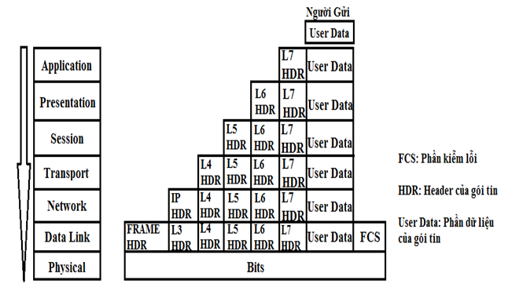
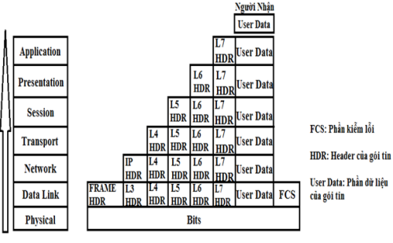
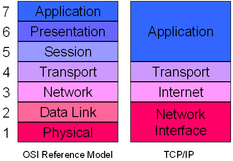
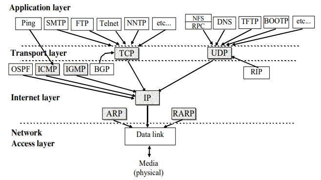

## Mô Hình OSI và Mô hình TCP/IP

## I. Mở đầu
### 1.1. Khái niệm Host

Là 1 thực thể mạng có khả năng truyền được các ứng dụng(www, dns, pop, smtp,...)

### 1.2. Mô hình mạng xưa

- Độc quyền: Dell <-> dell, HP <-> HP
- Các ứng dụng, phần mềm chỉ được cung cấp bởi nhà cung cấp. 
VD: HP chỉ đc dùng phần mềm do HP cung cấp
=> Hiện không còn dùng vì không có tính tương thích cao giữa các thiết bị

### 1.3. Mô hình ngày nay. Mô hình phân lớp. 
#### 1.3.1.	Mô hình phân lớp là gì?

Việc truyền một gói tin từ nguồn đến đích trải qua rất nhiều công việc. 
Chia các công việc thành các nhóm công việc, mỗi nhóm công việc đảm 
nhiệm các chức năng tương tự nhau. Mỗi phân lớp sẽ thực hiện một nhóm
công việc đó. 

#### 1.3.2.	Tại sao sử dụng mô hình phân lớp
- Giảm thiểu được sự phức tạp của hệ thống truyền dữ liệu vì các cv được chuyên biệt hóa nên các công ty ko phải thực hiện tất cả các CV từ trên xuống dưới mà cty nào mạnh về phần nào sẽ phát triển linh kiện, phần mềm cho công việc đó
- Sự chuẩn hóa giao diện và dòng sản phẩm: Mỗi lớp quyết định các tính năng, chuẩn các nhà sản xuất tham gia vào quá trình sản xuất buộc phải tuân thủ theo
- Đảm bảo tính tương thích về công nghệ: Thiết bị các hãng khác nhau
có thể giao tiếp với nhau.
- Thúc đẩy phát triển công nghệ mạng
- Đơn giản cho việc dạy và học 

## II. Mô hình OSI

Mô hình mạng máy tính do tổ chúc tiêu chuẩn hóa quốc tế ( ISO- International Standard Organization) đưa ra vào năm 1983 được gọi là mô hình tham chiếu các hệ thống mở ( Open Systems Interconect referent model –OSI).

Mô hình OSI gồm 7 lớp:

### 2.1. Layer 7: Appication
Là tầng giao tiếp trực tiếp với người dùng. Cung cấp các ứng dụng, dịch vụ . Cung cấp cơ chế xác thực người dùng. 

+ DNS: Dịch vụ phân giải tên miền
+ HTTP: Truyền dữ liệu web 
+ SMTP: Gửi mail
+ POP: Nhận mail
+ DHCP: Cấp phát IP động 
+ FTP: Truyền file
+ IMAP: NHận mail 

### 2.2. Presentation
Đảm bảo đầu này truyền đầu kia có thể đọc được.

Chức năng: 
+ Dịch dữ liệu để 2 bên có thể hiểu, định dạng và cấu trúc lại dữ liệu
+ Nén giữ liệu để giảm dung lượng dữ liệu truyền trên mạng
+ Mã hóa và giải mã hóa dderr đảm bảo sự bảo mật trên mạng

### 2.3. Sission 
Tạo, duy trì một phiên kết nối giữa ứng dụng nguồn và ứng dụng đích

### 2.4. Transport 
Quản lý kết nối đầu cuối 
+ Đảm bảo dưc liệu truyền
+ Thiêt slaapj và duy trì đường truyền ảo
+ Sửa lỗi, dò lỗi và phục hồi thông tin
Port gồm source port và destination port 
+ Source Port: tự sinh ra trong mỗi phiên kết nối
+ Destination Port: Là port xác định bạn dang sử dụng ứng dụng gì; ( Vd port 80: http; 110 POP, 25 SMTP, 53 DNS)

### 2.5. Network
Chọn ra 1 tuyến đường đi tối ưu nhất từ điểm này đến điểm khác
	
Đặc trưng của giao thức IP ( Internet Protocal)
+ Phi kết nối (Connectionless) không thiết lập trước khi truyền
+ Best effort: Truyền càng nhanh càng tôt và không có cơ chế đảm bảo tin cậy.
+ Các gói tin không phụ thuộc vào môi trường truyền dẫn

**Cấu trúc IP header**

IP Header Version 4 (tiêu đề gói tin IPv4) gồm 12 trường bắt buộc với tổng chiều dài là 20 byte (không tính các trường Options và Data). Cấu trúc của IP Header Version 4 như hình sau:
- Version (4 bit): Chỉ ra phiên bản IP đang được dùng 
- IP Header Length (IHL) (4 bit): Chỉ ra chiều dài của header, mỗi đơn vị là 1 word, mỗi word = 32 bit = 4 byte. Ở đây trường IP Header Length có 4 bit nên có 2^4 = 16 word = 16 x 4byte = 64 byte nên chiều dài header tối đa là 64 byte. Bình thường Hearder dài 20 byte. Đây là chiều dài của tất cả các thông tin Header.
- Type Of Services (TOS) (8 bit): Chỉ ra cách thức xử lý gói dữ liệu, có độ ưu tiên hay không, độ trễ cho phép của gói dữ liệu. Trường này thường được dùng để thực hiện quản lý chất lượng dịch vụ mạng.
- Total Length (16 bit): Chỉ ra chiều dài của toàn bộ tính theo byte, bao gồm data và phần header. Do có 16 bit nên tối đa là 2^16 = 65536 byte = 64 Kb nên chiều dài tối đa của 1 IP Datagram là 64 Kb.
- Identification (16 bit): Chỉ mã số của  1 IP Datagram , giúp bên nhận có thể ghép các mảnh của 1 IP Datagram lại với nhau vì IP Datagram phân thành các mảnh và  các mảnh thuộc cùng  1 IP  Datagram sẽ có cùng Identification.
- Flag (3 bit): Bit 0: không dùng, Bit 1: cho biết gói có phân mảnh hay không, Bit 2: nếu gói IP Datagram bị phân mảnh thì mảnh này cho biết mảnh này có phải là mảnh cuối không. Bao gồm 6 cờ: URG – cờ cho trường Urgent pointer, ACK – cờ cho trường Acknowledgement, PSH – hàm Push, RST – thiết lập lại đường truyền, SYN – đồng bộ lại số thứ tự, FIN – không gửi thêm dữ liệu.
- Fragment Offset (13 bit): Báo bên nhận vị trí offset của các mảnh so với gói IP datagram gốc  để có thể ghép lại thành IP datagram gốc.
- Time To Live (TTL) (8 bit):Thời gian sống của một gói tin. Con số này sẽ giảm đi 1, khi gói tin đi qua 1 router. Khi router nào nhận gói tin thấy  TTL đạt tới 0 gói này sẽ bị loại. Đây là giải pháp nhằm ngăn chặn tình trạng lặp vòng vô hạn của gói tin trên mạng.
- Protocol (8 bit): Chỉ ra giao thức nào của tầng trên (tầng Transport) sẽ nhận phần data sau khi công đoạn xử lí IP diagram ở tầng Network hoàn tất hoặc chỉ ra giao thức nào của tầng trên gởi segment xuống cho tầng Network đóng gói thành IP Diagram, mỗi giao thức có 1 mã (06:  TCP, 17: UDP, 01:  ICMP…).
- Header CheckSum (16 bit): Hỗ trợ cho Router phát hiện lỗi bit trong khi nhận IP datagram. Giúp bảo đảm sự toàn vẹn của IP Header.
- Source IP Address (32 bit): Chỉ ra địa chỉ của thiết bị truyền IP diagram (Xem cấu trúc của địa chỉ IPv4).
- Destination IP Address (32 bit): Chỉ ra địa chỉ IP của thiết bị sẽ nhận IP diagram (Xem cấu trúc của địa chỉ IPv4).
- IP Option: kích thước không cố định, chứa các thông tin tùy chọn như: Time stamp – thời điểm đã đi qua Router, j – lưu danh sách địa chỉ IP của Router mà gói phải đi qua, Source Route – bắt buộc đi qua Router nào đó. Lúc này sẽ không cần dùng bảng định tuyến ở mỗi Router nữa.
- Padding: Các số 0 được bổ sung vào trường này để đảm bảo IP Header luôn là bội số của 32 bit.

### 2.6.	Tầng liên kết dữ liệu ( Datalink) 
Điều khiển và truy nhập vào đường truyền vật lý. Các gói dữ liệu được mã hóa và giải mã thành các bit. Nó cho biết giao thức truyền tải, quản lý và xử lý lỗi trong lớp vật lý Physical, điều khiển luồng và đồng bộ khung.

Lớp Data Link có thể được chia nhỏ thành hai lớp:
- Media Access Control (MAC): Thiết lập sự nhận dạng của môi trường 
trên mạng thông qua địa chỉ MAC của nó. Địa chỉ MAC là địa chỉ được gán cho adapter mạng ở mức phần cứng. Đây là địa chỉ được sử dụng cuối cùng khi gửi và nhận các gói. 
- Logical Link Control (LLC) điều khiển sự đồng bộ khung, điều khiển 
 luồng và cung cấp một mức kiểm tra lỗi.

### 2.7. Tầng vật lý:
Là tầng cuối cùng trong mô hình OSI. 
Tầng duy nhất không tham gia bất kỳ thao tác logic nào, cũng thuần túy được thực thi trên phần cứng. 
Tuy nhiên tầng vật lý đóng vai trò quan trọng quyết định tốc độ truyền dữ liệu qua môi trường. 
Khi dữ liệu xuống tầng vật lý là frame, sẽ được mã hóa thành các 
chuỗi bit nhị phân, và được đẩy xuống môi trường truyền dẫn thành 
các tín hiệu điện. 

|Lớp|Mô tả|Các giao diện phổ biến|Đơn vị dữ liệu|Thiết bị|
|:---:|:---:|:---:|:---:|:---:|
|**Ứng dung**|Cung cấp các dịch vụ, ứng dụng giao tiếp trực tiếp với người dùng|HTTP, DNS, Telnet, POP..|Data|
|**Trình diễn**|Mã hóa, giải mã dữ liệu|JPG,BMP,PNG,..|Dữ liệu|
|**Phiên**|Thiết lập, theo dõi, chấm dứt các phiên kết nối|SQL,RPC,NETBIOS...|Dữ liệu|
|**Vận chuyển**|Đảm bảo việc truyền dữ liệu; sửa lỗi, dò lỗi, phục hồi thông tin|TCP, UDP|Segment|
|**Mạng**|Xác định đường đi, địa chỉ logic|IP, IPX|Packet|Switch L3, Router|
|**Liên kết dữ liệu**|Gồm 2 lớp: LLC, MAC|LAN,WAN|Frame|SWitch, Bridge|
|**Vật lý**|Mã hóa và truyền các bit dữ liệu|Ethernet|Bit(0,1)|HUb, Repeater|

### 2.8. Quá trình truyền gói tin trong mô hình mạng OSI 

**Phía gửi**

Mỗi gói tin dữ liệu khi được đưa xuống các tầng thì được gắn các header của tầng đó, riêng ở tầng 2 (Data Link), gói tin được gắn thêm FCS (phần kiểm tra lỗi).

- B1: Ở tầng Application (tầng 7), người dùng tiến hành đưa thông tin cần gửi vào máy tính. 
Các thông tin này thường có dạng như: hình ảnh, văn bản,…
- B2: Thông tin dữ liệu này được chuyển xuống tầng Presentation để chuyển các dữ liệu thành một dạng chung để mã hóa dữ liệu và nén dữ liệu.
- B3: Dữ liệu tiếp tục được chuyển xuống tầng Session. 
Tầng này là tầng phiên có chức năng bổ sung các thông tin cần thiết cho phiên giao dịch (gửi- nhận) này. 
- B4: Tại tầng Transport, dữ liệu được cắt ra thành nhiều Segment và cũng làm nhiệm vụ bổ sung thêm các thông tin về phương thước vận chuyển dữ liệu để đảm bảo tính bảo mật, tin cậy khi truyền trong mô hình mạng.
- B3: Xuống tầng Network các segment lại tiếp tục được cắt ra thành nhiều gói Package khác nhau và bổ sung thông tin định tuyến. 
- B5: Tầng Network chức năng chính của nó là định tuyến đường đi cho gói tin chứa dữ liệu.
- B6: Dữ liệu tiếp tục được chuyển xuống tầng Data Link (tầng 2). Tại tầng này, mỗi Package sẽ được chia ra thành nhiều Frame và bổ sung thêm các thông tin kiểm tra gói tin chứa dữ liệu để kiểm tra ở máy nhận.
- B7: Lớp Physical sẽ được chuyển thành một chuỗi các bit nhị phân (0 1….) và được đưa lên cũng như phá tín hiệu trên các phương tiện truyền dẫn  (dây cáp đồng, cáp quang,…) để truyền dữ liệu đến máy nhận.

**Phía nhận**

- B1: Tầng Physical phía máy nhận sẽ kiểm tra quá trình đồng bộ và đưa các chuỗi bit nhị phân nhận được vào vùng đệm. 
- B2: Tiếp đó tầng Data Link sẽ tiến hành kiểm tra các lỗi trong frame mà bên máy gửi tạo ra bằng cách kiểm tra FCS có trong gói tin được gắn bên phía máy nhận. 
Nếu có lỗi xảy ra thì frame đó sẽ bị hủy bỏ. Sau đó kiểm tra địa chỉ lớp Data Link (Địa chỉ MAC Address) xem có trùng với địa chỉ của máy nhận hay không. 
Nếu đúng thì lớp Data Link sẽ thực hiện gỡ bỏ Header của tầng Data Link để tiếp tục chuyển lên tầng Network.
- B3: Tầng Network sẽ tiến hành kiểm tra xem địa chỉ trong gói tin này có phải là địa chỉ của máy nhận hay không. (địa chỉ ở tầng này là địa chỉ IP). Nếu đúng địa chỉ máy nhận, tầng Network sẽ gỡ bỏ Header của nó và tiếp tục chuyển đến tầng Transport để tiếp tục qui trình.
- B4: Ở tầng Transport sẽ hỗ trợ phục hồi lỗi và xử lý lỗi bằng cách gửi các gói tin ACK. Sau khi phục hồi sửa lỗi, tầng này tiếp tục sắp xếp các thứ tự phân đoạn và đưa dữ liệu đến tầng Session.
- B5: Tầng Session làm nhiệm vụ đảm bảo các dữ liệu trong gói tin nhận được toàn vẹn. Sau đó tiến hành gỡ bỏ Header của tầng Session và tiếp tục gửi lên ầng Presentation.
- B6: Tầng Presentation sẽ xử lý gói tin bằng cách chuyển đối các định dạng dữ liệu cho phù hợp. Sau khi hoàn thành sẽ tiến hành gửi lên tầng Application.
- B7: Cuối cùng, tầng Application tiến hành xử lý và gỡ bỏ Header cuối cùng. Khi đó ở máy nhận sẽ nhận được dữ liệu của gói tin được truyền đi.

## III. Mô hình TCP/IP

ICP/IP là một bộ giao thức phát triển bởi cục accs dự án nghiên cứu cấp cao (ARPA) của bộ quốc phòng Mỹ. TCP/IP sử dụng rộng rãi trong mạng máy tính, điển hình là mạng internet.

Chồng giao thức TCP/I gồm 4 tầng:

### 3.1. Tầng Truy nhập mạng
Cung cấp một giao tiếp với mạng vật lý, kiểm soát lỗi cho dữa liệu phân bố trên mạng vật lý.

Chức năng: Ánh xạ 1 địa chỉ Ip sang 1 địa chỉ vật lý và đóng gói dữ liệu Ip vào khung. 
### 3.2. Tầng Internet: 
Tầng Internet ( hay còn gọi là tầng liên mạng) xử lý quá trình truyền gói tin trên mạng, các giao thức của tầng này bao gồm : IP ( Internet Protocol) , ICMP ( Internet Control Message Protocol) , IGMP ( Internet Group Message Protocol )
-	IP (Giao thức Internet) – Giao thức chính
IP: cung cấp dịch vụ chuyển dữa liệu nỗ lực tối đa và phi kết nối. Chức năng chính là  đánh địa chỉ logic và định tuyến các gói giữa các mạng đảm bảo gói tin đến đúng mạng đích
-	ARP: Xác định địa chỉ vật lý (địa chỉ MAC) tương ứng với một địa chỉ IP.
-	ICMP : Cung cấp khả năng thông báo lỗi và kiểm soát
Hai ví dụ về tin nhắn ICMP bao gồm:
	+ Không thể truy cập đích - được sử dụng khi bộ định tuyến không thể xác định vị trí đích
	+ Thời gian vượt quá - được sử dụng khi Thời gian sống ( TTL ) của gói tin bằng không
-	RARP: Xác định đại chỉ IP tương ứng với một địa chỉ MAC 
### 3.3. Tầng giao vận: 
Cung cấp dịch vụ truyền tải từ trạm nguồn đến trạm đích, tầng này có 2 giao thức chính là TCP ( Transmisson Control Protocol) và UDP ( User Datagram Protocol ) 
- TCP cung cấp luồng dữ liệu tin cậy giữa 2 trạm, nó sử dụng các cơ chế như chia nhỏ các gói tin ở tầng trên thành các gói tin có kích thước thích hợp cho tầng mạng bên dưới, báo nhận gói tin, đặt hạn chế thời gian timeout để đảm bảo bên nhân biết được các gói tin đã gửi đi. Do tầng này đảm bảo tính tin cậy nên tầng trên sẽ không cần quan tâm đến nữa 
- UDP cung cấp một dịch vụ rất đơn giản hơn cho tầng ứng dụng . Nó chỉ gửi dữ liệu từ trạm này tới trạm kia mà không đảm bảo các gói tin đến được tới đích. Các cơ chế đảm bảo độ tin cậy được thực hiện bởi tầng trên Tầng ứng dụng. 

### 3.4. Tầng ứng dụng 
Là tầng trên của mô hình TCP/IP bao gồm các tiến trình và các ứng dụng cung cấp cho người sử dụng để truy cập mạng. Có rất nhiều ứng dụng được cung cấp trong tầng này, mà phổ biến là Telnet: sử dụng trong việc truy cập mạng từ xa, FTP ( File Transport Protocol ) dịch vụ truyền tệp tin., EMAIL : dịch vụ truyền thư tín điện tử. WWW ( Word Wide Web )
- FTP (File Transfer Protocol): Đây là một dịch vụ hƣớng kết nối và tin cậy, sử
dụng TCP để cung cấp truyền tệp giữa các hệ thống hỗ trợ FTP.
- Telnet (TERminaL NETwork): Cho phép các phiên đăng nhập từ xa giữa các máy tính. Do Telnet hỗ trợ chế độ văn bản nên giao diện người dùng thương ở dạng dấu nhắc lệnh tương tác. Chúng ta có thể đánh lệnh và các thông báo trả lời sẽ được hiển thị.
- HTTP (Hyper Text Transfer Protocol): Trao đổi các tài liệu siêu văn bản để hỗ trợ WEB.
- SMTP (Simple Mail Transfer Protocol): Truyền thư điện tử giữa các máy tính. Đây là dạng đặc biệt của truyền tệp đƣợc sử dụng để gửi các thông báo tới một máy chủ thư hoặc giữa các máy chủ thư với nhau.
- POP3 (Post Office Protocol): Cho phép lấy thƣ điện tử từ hộp thư trên máy chủ.
- DNS (Domain Name System): Chuyển đổi tên miền thành địa chỉ IP. Giao thức này thường được sử dụng khi người dùng sử dụng dùng tên chứ không dùng địa chỉ IP.
- DHCP (Dynamic Host Configuration Protocol): Cung cấp các thông tin cấu hình động cho các trạm, chẳng hạn nhƣ gán địa chỉ IP.
- SNMP (Simple Network Management Protocol): Được sử dụng để quản trị từ xa các thiết bị mạng chạy TCP/IP. SNMP thường đƣợc thực thi trên các trạm của ngƣời quản lý, cho phép người quản lý tập trung nhiều chức năng giám sát và điều khiển trong mạng. 

## IV. So sánh mô hình OSI và TCP/IP
- Giống nhau
	- Cả hai đều có kiến trúc lớp.
	- Các lớp cung cấp các chức năng tương tự
- Khác nhau

|TCP/IP|OSI|
|:---:|:---:|
|Cấu trúc rút gọn hơn OSI (4 tâng)|7 tầng|
|Được phát triển dựa trên OSI và xaoy quanh internet|Mô hình lý thuyết|
|Các giao thức được thiết kế đầu tiên, mô hình phát triển sau|Mô hình phát triển trước, giao thức phát triển sau.|
|TCP/IP chỉ hỗ trợ truyền thông không kết nối phát ra từ tầng mạng|Hỗ trợ cả kết nối không dây và kết nối theo định tuyến trong tầng mạng|
|OSI có ranh giới chặt chẽ|Không có ranh giới nghiêm ngặt.|
|TCP / IP là một giao thức chuẩn được sử dụng cho mọi mạng bao gồm cả Internet|Không phải là một giao thức mà là một mô hình tham chiếu được sử dụng để hiểu và thiết kế kiến trúc hệ thống|

Khi xây dựng 1 mô hình thường có 2 ý tưởng: Mô hình tham chiếu ( phân lớp), mô hình chồng giao thức
Ngày nay đa số các hệ thống sử dụng các giao thức của chồng giao thức TCP/IP  (www, telnet, DNS, SMTP,..)
Sử dụng giao thức của TCP/IP nhưng lại tham chiếu đến mô hình OSI. 

