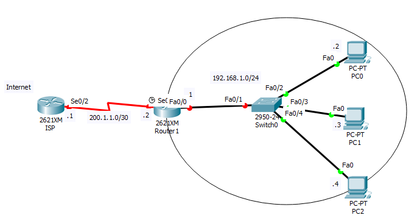

## Tìm hiểu giao thức Nat 

### 1.	Giới thiệu 
Không gian IP được chia thành 2 phần: Ip Private và Ip publish 

-	IP private chỉ sử dụng trong mạng Lan, mạng nội bộ, các doanh nghiệp. Có thể tái sử dụng trong các mô hình mạng Lan. 

Dải IP private: 

	+ Lớp A: 10.x.x.x
	+ Lớp B: 172.16.x.x-172.31.x.x
	+ Lớp C: 192.168.x.x

-	IP publish: Được dùng trong môi trường internet, được dùng trong định truyến toàn cầu.

Nguyên tắc là các địa chỉ IP private không ra được internet nên phải sử dụng kỹ thuật Nat. 

**NAT: Ánh xạ địa chỉ IP private sang IP publish.**

### 2. Nguyên tắc hoạt động 

Khi một máy con thực hiện kết nối hoặc gửi dữ liệu tới một máy tính 
nào đó trên internet, dữ liệu sẽ được gởi tới NAT, sau đó NAT sẽ thay thế địa chỉ IP gốc của máy con đó rồi gửi gói dữ liệu đi với địa chỉ IP của 
NAT ra ngoài internet. Quá trình chuyển đổi địa chỉ sẽ được lưu thông tin trong bảng Nat. Khi gói tin trở về dựa vào bảng nat record để trả gói tin 
về đúng máy yêu cầu dưc liệu.

### 3. Các loại cấu hình NAT 

- Static Nat: Một địa chỉ IP private sẽ ánh xạ qua IP publish để ra ngoài internet 

- Dynamic Nat: Một địa chỉ IP Private sẽ được ánh xạ với một địa chỉ IP Public trong nhóm địa chỉ IP Public.

- Nat overload : Tất cả các địa chỉ Ip private sử dụng duy nhất 1 địa chỉ Ip publish  đi ra ngoài internet.

Mỗi phiên kết nối sẽ phân biệt bởi các port (1-65535)
	+ Ưu điểm: 
		+ Tiết kiệm Ip publish  
		+ Tăng cường tính bảo mật vì Nat overload ko cho phép khởi tạo từ bên ngoài vào.
	+ Nhược: Tăng tải trên thiết bị lớn
	
### 4. Cấu hình NAT

Cho topo như hình: 



- Cấu hình Static Nat

Cấu hình static Nat chuyển đổi địa chỉ IP private 192.168.1.1 thành 200.1.1.2
```
Router(config)#ip nat inside source static 192.168.1.1  200.1.1.2
Router(config)#int s0/1
Router(config-if)#ip nat outside
Router(config)#int f0/0
Router(config-if)#ip nat inside
```
- Cấu hình Nat overload 

Cấu hình cho phép dải địa chỉ 191.168.1.0 ra được internet
```
Router(config)#access-list 1 permit 192.168.1.0  0.0.0.255
Router(config)#ip nat inside source list 1 interface s0/1 overload 
Router(config)#int s0/1
Router(config-if)#ip nat outside
Router(config)#int f0/0
Router(config-if)#ip nat inside
```
- Cấu hình Dynamic Nat
```
Router(config)#Access list 10 permit 192.168.0.0  0.0.0.255 
Router(config)#ip nat pool public_range 200.1.1.1  200.1.1.6 netmask 255.255.255.248
Router(config)#ip nat inside source list 10 pool public_range
Router(config)#int s0/1
Router(config-if)#ip nat outside
Router(config)#int f0/0
Router(config-if)#ip nat insidek
```

Kiểm tra bảng Nat 
```
Router#show ip nat translations 
```
