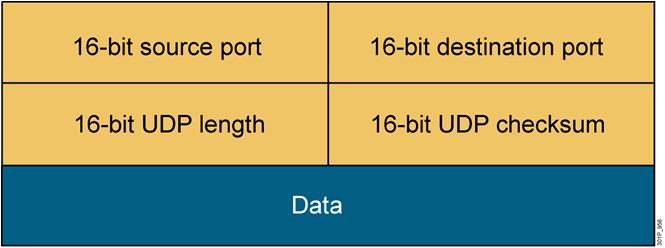
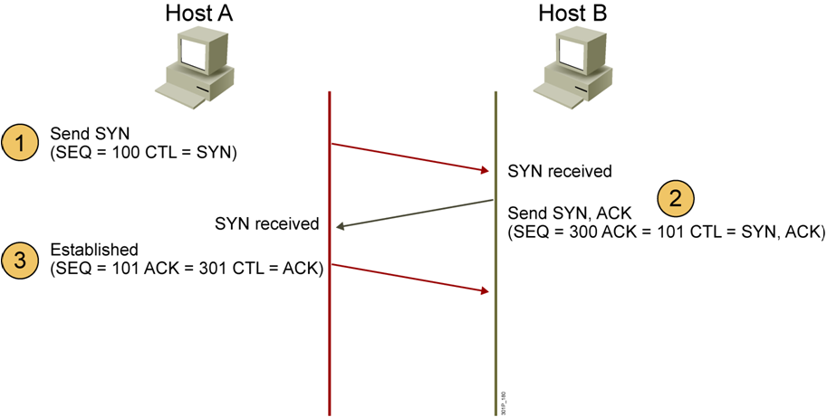
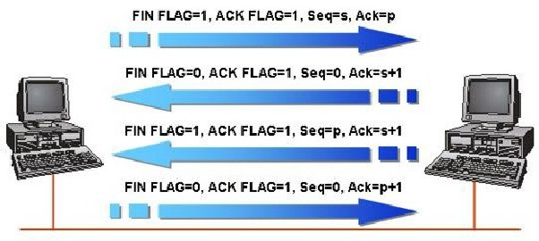
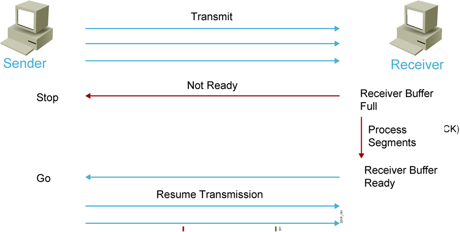
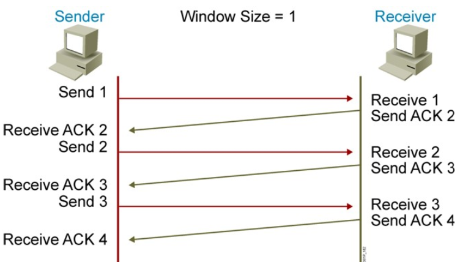
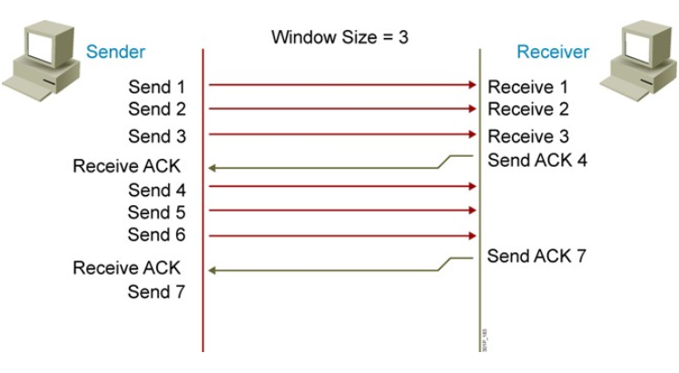
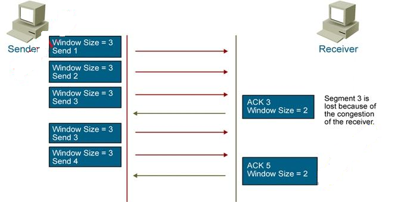
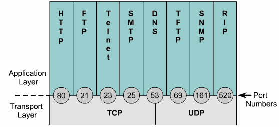

### I. Giao thức UDP
Giao thức UDP (User Datagram Protocol) là giao thức phi kết nối (connectionless) hoạt động trên lớp giao vận (Transport) của chồng giao thức TCP/IP hoặc mô hình OSI. 

UDP có các tính chất sau:
+ Đơn vị: datagram 
+ Không tin cậy và không quan tâm đến thứ tự gói tin truyền 
+ Các gói tin có thể bị mất trên đường truyền 
+ Quá trình truyền tin nhanh
+ Khắt khe về thời gian

**Cấu trúc UDP header**

UDP header có độ dài 8 byte
- 16bit port nguồn
- 16 bits port đích
- 16 bit UDP Length: cho biết toàn bộ gói tin UDP dài tổng cộng bao nhiêu byte. Ta thấy 16 bit thì sẽ có tổng cộng 2^16 byte = 65536 giá trị (từ 0 -> 65535 byte).
- 16 bit UDP checksum: sử dụng thuật toán mã vòng CRC để kiểm lỗi. Và chỉ kiểm tra một cách hạn chế.

### II. Giao thức TCP
TCP là một giao thức hướng kết nối(connection-oriented), hoạt động trên lớp giao vận(Transport) của chồng giao thức TCP/IP, OSI.

Đặc điểm: 
+ Các gói tin đến nơi nhận một cách chính xác, đúng thứ tự
+ Connection orientd protocol: Thiết lập kết nối trước khi truyền
+ Full duplex: Cơ chế truyền và nhận tại cùng 1 thời điểm
+ Kiểm tả lỗi
+ Đánh số tứ tợ các gói tin
+ Cơ chế báo nhận 
+ Cơ chế điều khiển luồng
+ Phục hồi dữ liệu (Khi không có ACK thì gửi lại) 

**Cấu trúc TCP header**

Cấu trúc Header TCP có độc dài 20byte
- Port nguồn (16 bits): Do máy nguồn tự sinh ra trong mỗi phiên kết nối
- Port đich (16bits): Là port để xác định ứng dụng đang truyền à ứng dụng gì.
- Sequence number (32bits): Đánh dấu thứ tự các segment 
- ACK number(32bits): Cơ chế xác nhanajj trong phiên truyền thông
- Window size(16bits): Giá trị kích thước cửa sổ, quyết định lượng dữ liệu trong 1 lần truyền thông.
- 4 bit header length: cho biết toàn bộ header dài bao nhiêu Word (1 Word = 4 byte).
- 16 bit urgent pointer: được sử dụng trong trường hợp cần ưu tiên dữ liệu ( kết hợp với bit điều khiển u r g ở trên).
- 16bits TCP checksum: Kiểm tra lỗi
- Các trường ở trên là cố định, TCP dành cho chúng ta trường Option để lập trình thêm các tính năng cho TCP nếu có nhu cầu.

### 2.1. Cơ chế bắt tay 3 bước

TCP là giao thức hướng kết nối Connection oriented. Host A định truyền dữ liệu cho host B thì phải thiết lập qua các kết nối sau

+ B1: Gửi 1 gói tin TCP có cờ SYN được bật lên, số thứ tự được đánh là 100
+ B2: Bên B nhận được SYN sau đó gửi lại gói tin có cờ SYN và ACK được bật lên tức gói tin này báo nhận được gói tin trước đó A gửi cho. ACK=101 với ngụ ý đã nhận được gói tin mang sô thứ tự 100 và mong muốn nhận được gói tin tiếp theo là 300.
+ B3: Kết nối được thiết lập: Bên A báo nhận và gửi gói tin SEQ=101 (đáp ứng yêu cầu bên B) và ACK=301 báo nhận cho gói tin 300, chỉ có cờ ACK được bật lên vì gói tin 3 báo nhận cho gói tin 2. 

**Quá trình ngắt kết nối**

Quá trình kết thúc là 2 quá trình kết thúc 1 chiều độc lập nhau:
+ B1: Giả sử bên  A muốn ngắt kết nối, nó sẽ gửi 1 cờ FIN, Ack =p ngụ ý là nó đã nhận được bản tin p-1 và yêu cầu bên B gửi bản tin s. 
Khi đó kết nối tồn tại dạng "nửa mở" A đã kết thúc việc gửi dữ liệu và chỉ nhận trong khi bên B vẫn tiếp tục gửi. 
+ B2: Cờ ACK được bật lên, ACK =s+1 ngụ ý đã nhận được bản tin yêu cầu từ bên A và ko yêu cầu gửi gói tin tiếp SEQ=0.
+ B3: Để kết nối đóng hoàn toàn, bên B cũng phải làm tương tự tức là gửi 1 cờ FIN cho bên A, ACK = s+1 ngụ ý đã nhận được gói tin s Và yêu cầu gửi p 
+ B4. Bên A Gửi ACK =p+1 ngụ ý đã nhận được yêu cầu gửi gói tin p từ A, SEQ=0 ko yêu cầu gửi gói tin tiếp.

### 2.2. Cơ chế điều khiển luồng Flow Control 

Khi bên gửi A gửi quá nhiều dữ liệu cho bên B, bên B phải đưa vào buffer để xử lý nhưng đến 1 lúc nào đó buffer bị đầy B sẽ gửi tín hiệu “Đừng truyền” thì A sẽ dừng lại. Lúc này B tieepps tục xử lý dần các segment trong bộ đệm của nó cho đến khi buffer trống trở lại thì B gửi tín hiệu “sẵn sàng” A tiếp tục truyền dữ liệu.

### 2.3. Cơ chế báo nhận (ACK)

Khi A gửi một gói tin cho B, B phải báo nhận cho A. Nếu không thấy báo nhận, A sẽ chờ hết khoảng thời gian timeout tiếp tục gửi lại gói tin cho đến khi nào nhận được thì thôi.

Send ACK =2: Tức tôi đã nhận được gói tin 1 mong muốn nhận được gói tin 2:

Window Size =1: Gửi 1 nhận 1.

Như vậy sẽ rất mất thời gian thay vì đso gửi nhiều gói cùng lúc và nhận 1 lần.

### 2.4. Cơ chế cửa sổ trượt TCP Sliding Windowing 

## III. So sánh UDP và TCP
### 3.1. Các cổng dịch vụ và một số dịch vụ thông dụng
Khi một thực thể lớp Transport đọc thông tin trên TCP hoặc UDP header, nó có thể xác định được dữ liệu đang đóng gói bên trong TCP segment hay UDP datagram là của giao thức Application nào mà không cần phải mở gói để xem nội dung bên trong. Để thực hiện được điều này , chồng giao thức lớp trên TCP/IP sử dụng tham số port trong TCP/UDP header để nhận diện giao thức lớp trên đang được đóng gói trong phần data. 

- FTP: chạy trên nền TCP, sử dụng port 20 hoặc 21
- HTTPS: chạy trên nền TCP, sử dụng port 443
- POP3: chạy trên nền TCP, sử dụng port 110
- SNMP: chạy trên nền UDP, sử dụng port 161 hoặc 162
- v.v..
### 3.2. So sánh 
- Giống nhau
	+ Giao thức thuộc tầng transport 
	+ Có chức năng kết nối và truyền dữ klieeuj  giữa các host 
- Khác nhau

| |TCP|UDP|
|:---:|:---:|:---:|
|**Kích thước header**|20 byte ( Do hỗ trợ nhiều chức năng hữu ích hơn)|8 byte |
|**Tốc độ truyền**|Thấp hơn UDP|Truyền tốc độc cao|
|**Độ tin cậy**|Đảm bảo|Không đảm bảo|
| |Connection-oriented|Connectionless|
| |Phức tạp|Đơn giản|
|**Các giao thức**|FTP, HTTP, SMNP, Telnet|TFTP, SNMP, DHCP, DNS|

